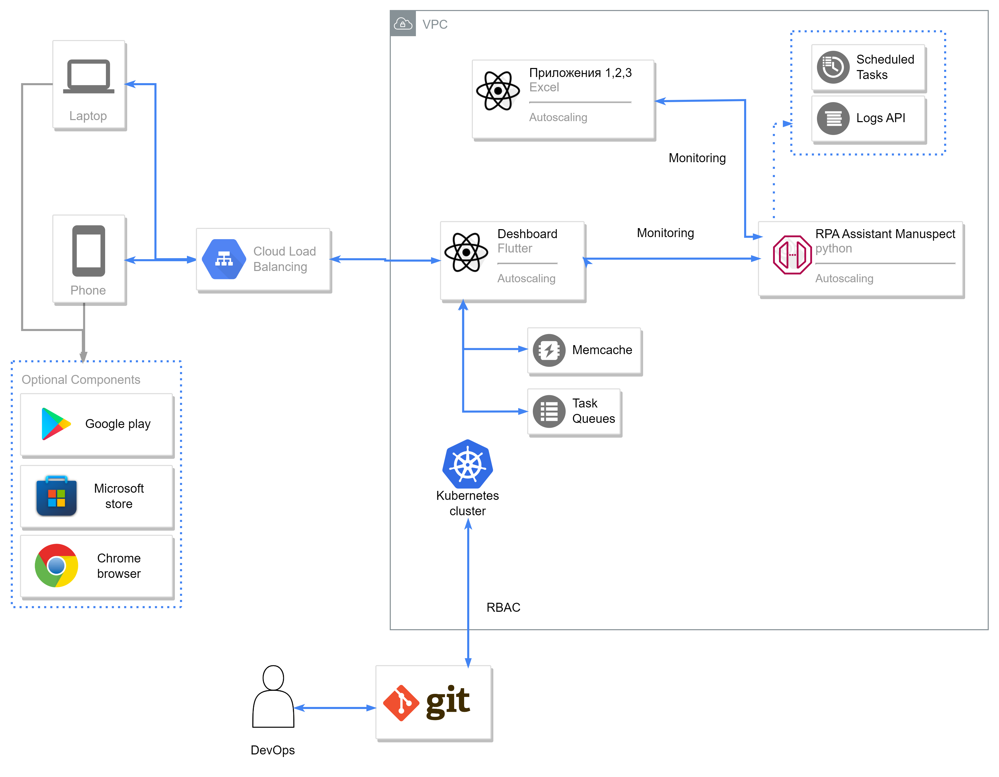

# Robot for nestro-challenge, 3 track

## "Приложение 1.xlsx" и "Приложение 2.xlsx"

Возможности изменений:

Строки: содержание, кол-во, порядок - да 

Столбцы: названия, порядок - нет

[Постановка задачи для дэшбордов и требования к автоматизации в приложениях](https://autumn-athlete-fea.notion.site/b0f7889d5f774bfea0f683e0ef71b654?pvs=4)

## Запуск робота и автоматизации

app_1_2_preprocessor собирает данные из браузера, приложения 2 и обновляет приложение 1

```console
rcc task run --robot ./robot.yaml --task app_1_2_preprocessor
```

app_1_postprocessor собирает данные из приложения 1 и заполняет файл `./output/shared/workitems.json`, отвечающий за отображение графиков с помощью flutter

```console
rcc task run --robot ./robot.yaml --task app_1_postprocessor
```

## Архитектура




## Запуск дэшбордов

Подробности для запуска дэшбордов в [этом репозитории](https://github.com/alexeynau/flutter-dashboard)